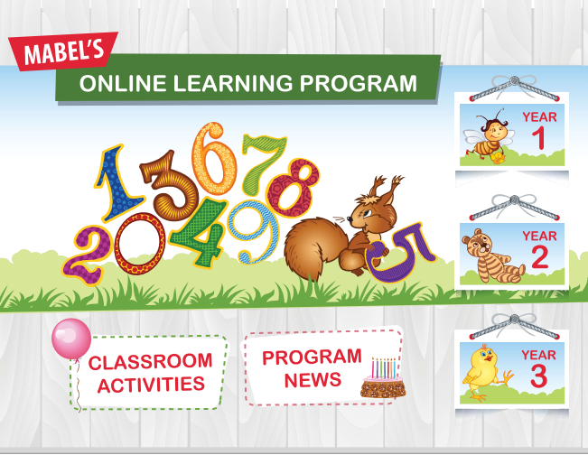

## 3.3.1 Prinsip Reka Bentuk Laman Web
### **1\. Pengenalan Prinsip Reka Bentuk Laman Web**

* **Definisi Prinsip:** Merujuk kepada asas yang menjadi dasar kepada perkembangan atau pembinaan sesuatu benda.  
* **Definisi Reka Bentuk:** Merujuk kepada susunan atau struktur dalam proses pembinaan sesuatu perkara.  
* **Analogi:** Proses ini diibaratkan seperti merancang dan membina rumah di mana setiap ruang (tamu, dapur, bilik) mempunyai fungsi dan tata hias berbeza .  
* **Kepentingan:**  Elemen reka bentuk mempengaruhi pengalaman dan kepuasan pengguna semasa melayari laman web.   

  ---

 ### **2\. Persekitaran Laman Web**

Sebelum membina laman web, faktor teknikal persekitaran web perlu diambil kira:

* **Jenis Pelayar:** Laman web perlu sesuai dipaparkan pada pelbagai pelayar seperti Google Chrome, Mozilla Firefox, dan Internet Explorer. Pereka tidak boleh tertumpu pada satu versi pelayar sahaja.  
* **Capaian Internet:** Kelajuan capaian pengguna berbeza; laman web hiburan/permainan memerlukan capaian lebih laju berbanding laman web berita.  
* **Perisian Sokongan:** Sesetengah laman web memerlukan perisian tambahan (contohnya Flash untuk animasi).  
* **Peranti Paparan:** Kepelbagaian saiz monitor dan peranti mudah alih mempengaruhi paparan. 


 
 
 ---

 ### **3\. Prinsip-Prinsip Utama Reka Bentuk Web**

Terdapat beberapa prinsip utama untuk memastikan laman web berkesan:

#### **A. Penekanan Maklumat (Emphasis)**


* Bertujuan menarik perhatian pengguna kepada maklumat penting.  
* **Teknik Penekanan:**  
  * Menggunakan kesan khas seperti *drop shadow*, tekstur, atau cahaya.  
  * Menggunakan ruang putih (*white space*) untuk menonjolkan elemen.  
  * Menggunakan fungsi *bold*, *italic*, warna berbeza, dan *border*.

 #### **B. Perbezaan Elemen (Contrast)**


* Digunakan untuk membezakan elemen-elemen dalam laman web.  
* **Kaedah:**  
  * Penggunaan label dan pautan yang berbeza.  
  * Penggunaan *border*, warna, kesan khas, dan ruang putih.  
  * Contoh: Membezakan warna butang *Login* supaya lebih jelas.

 #### **C. Tipografi (Typography)**


* Merujuk kepada penyusunan teks dalam laman web untuk memudahkan pembacaan dan nampak profesional.  
* **Corak Penyusunan:** Mengikut gaya bacaan pengguna seperti corak *Z-shaped* atau *F-shaped*.  
* **Pemilihan Fon:**  
  * Gunakan "Fon Selamat" (*Web Safe Fonts*) yang disokong oleh kebanyakan sistem operasi (Contoh: Arial, Impact, Courier New, Georgia).  
  * Seragamkan jenis teks bagi setiap halaman.  
  * Gunakan saiz teks berbeza untuk membezakan tajuk dan huraian.

 #### **D. Warna dan Grafik**


* Penggunaan warna bijak menarik perhatian dan meningkatkan kebolehbacaan.  
* **Pantang Larang:**  
  * Elakkan warna latar belakang dan teks yang senada kerana sukar dibaca.  
  * Elakkan penggunaan warna yang terlalu berwarna-warni kerana boleh menyebabkan pembaca hilang fokus.

 #### **E. Navigasi**


* Merujuk struktur laman web yang memudahkan pengguna bergerak atau mencari lokasi semasa mereka.  
* **Teknik Navigasi:**  
  * Bar navigasi.  
  * *Breadcrumbs* (Menunjukkan jejak lokasi).  
  * Menu *Drop-down*.  
  * *Site map* (Peta laman).  
  * Pautan menggunakan grafik.

 #### **F. Keseimbangan Visual**



* Memastikan susun atur elemen dalam laman web kelihatan seimbang dan tidak berat sebelah.  
  ---

 ### **4\. Reka Bentuk Berasaskan Pengguna**

Reka bentuk mestilah memenuhi kehendak dan tujuan pengguna sasaran.

* **Memahami Tujuan:** Adakah pengguna mahu membaca artikel atau mencari maklumat?.  
* **Contoh (Google):** Google popular kerana reka bentuknya ringkas, mudah difahami, tiada iklan serabut, dan fokus pada satu objektif (carian).  
* **Kebolehcapaian (Accessibility):** Laman web perlu mengambil kira pengguna Orang Kelainan Upaya (OKU) yang mungkin menggunakan peralatan sokongan pendengaran atau penglihatan . 


  ---

 


# Latihan
```quiz
 { "question": "1. Dalam prinsip reka bentuk laman web, apakah yang dimaksudkan dengan 'Emphasis' (Penekanan)?", "options": [ "Menyusun teks mengikut corak Z-shaped untuk pembacaan pantas.", "Teknik untuk menarik perhatian pengguna kepada maklumat atau elemen yang penting.", "Memastikan laman web boleh dibuka pada pelbagai jenis pelayar web.", "Menyediakan peta laman (site map) untuk memudahkan pergerakan pengguna." ], "correctIndex": 1 }
```
```quiz
 { "question": "2. Pereka web disarankan menggunakan 'Web Safe Fonts'. Mengapakah pemilihan fon ini sangat penting?", "options": [ "Kerana fon ini mempunyai warna yang lebih menarik dan terang.", "Kerana fon ini disokong secara meluas oleh kebanyakan sistem operasi dan pelayar web.", "Kerana fon ini secara automatik menukarkan saiz teks mengikut peranti.", "Kerana fon ini hanya boleh dibaca oleh pengguna Orang Kelainan Upaya (OKU)." ], "correctIndex": 1 }
```
```quiz
 { "question": "3. Antara berikut, manakah teknik navigasi yang membantu pengguna mengetahui jejak lokasi semasa mereka di dalam sesebuah laman web?", "options": [ "Drop shadow", "White space", "Breadcrumbs", "Z-shaped pattern" ], "correctIndex": 2 }
```
```quiz
 { "question": "4. Mengapakah laman web Google dianggap sebagai contoh reka bentuk berasaskan pengguna yang sangat baik?", "options": [ "Kerana ia menggunakan pelbagai jenis fon dan animasi yang berwarna-warni.", "Kerana ia mempunyai navigasi yang sangat kompleks dan mencabar.", "Kerana reka bentuknya ringkas, mudah difahami, dan fokus pada satu objektif utama sahaja.", "Kerana ia memerlukan perisian sokongan tambahan seperti Flash untuk berfungsi." ], "correctIndex": 2 }
```
```quiz
 { "question": "5. Manakah antara situasi berikut yang melanggar prinsip warna dan grafik dalam reka bentuk web?", "options": [ "Menggunakan teks berwarna hitam di atas latar belakang putih.", "Menggunakan border untuk membezakan antara dua kotak maklumat.", "Menggunakan warna latar belakang yang hampir senada dengan warna teks sehingga sukar dibaca.", "Menyeragamkan jenis teks bagi setiap halaman laman web." ], "correctIndex": 2 }
```