# 数据库类图 (Database Class Diagram)

## 表结构总览

### 核心实体表

#### 1. **users** (用户表)
- `user_id` (UUID, PK) - 主键
- `name` (string) - 姓名
- `email` (string, unique) - 邮箱
- `phone_no` (string) - 电话
- `address` (text) - 地址
- `gender` (string) - 性别
- `password` (string) - 密码
- `account_status` (enum: 'active', 'inactive') - 账户状态
- `role_id` (UUID, FK -> roles.role_id, nullable) - 角色ID
- `remember_token` (string) - 记住我令牌
- `created_at` (timestamp)
- `updated_at` (timestamp)

**关系：**
- 属于一个 Role (belongsTo)
- 可以创建多个 Achievement (hasMany)
- 可以创建多个 Notes (hasMany)
- 可以拥有多个 Achievement (belongsToMany through achievement_user)
- 可以作为教师管理多个 Class (hasMany through classes.teacher_id)
- 可以作为管理员创建多个 Class (hasMany through classes.admin_id)
- 可以注册多个 Class (belongsToMany through class_student)
- 可以创建多个 Level (hasMany through levels.created_by)
- 可以参与多个 LevelUser (hasMany)
- 可以有多个 ChatbotSession (hasMany)
- 可以作为学生接收 Feedback (hasMany through feedbacks.student_id)
- 可以作为教师发送 Feedback (hasMany through feedbacks.teacher_id)

---

#### 2. **roles** (角色表)
- `role_id` (UUID, PK) - 主键
- `role_name` (string) - 角色名称

**关系：**
- 拥有多个 User (hasMany)

---

#### 3. **classes** (班级表)
- `class_id` (UUID, PK) - 主键
- `class_name` (string(100), unique) - 班级名称（唯一）
- `teacher_id` (UUID, FK -> users.user_id, nullable) - 教师ID
- `description` (text, nullable) - 描述
- `admin_id` (UUID, FK -> users.user_id, nullable) - 管理员ID
- `focus` (string(50), nullable) - 专注领域
- `created_at` (timestamp)
- `updated_at` (timestamp)

**关系：**
- 属于一个 Teacher (belongsTo User)
- 属于一个 Admin (belongsTo User)
- 拥有多个 Student (belongsToMany through class_student)
- 拥有多个 Level (belongsToMany through class_levels)

---

#### 4. **class_student** (班级-学生关联表)
- `class_id` (UUID, FK -> classes.class_id, PK) - 班级ID（复合主键）
- `student_id` (UUID, FK -> users.user_id, PK) - 学生ID（复合主键）
- `enrolled_at` (timestamp) - 注册时间

**关系：**
- 属于一个 Class (belongsTo)
- 属于一个 User/Student (belongsTo)

---

#### 5. **class_levels** (班级-关卡关联表)
- `class_level_id` (UUID, PK) - 主键
- `class_id` (UUID, FK -> classes.class_id) - 班级ID
- `level_id` (UUID, FK -> levels.level_id) - 关卡ID
- `is_private` (boolean, default: false) - 是否私有
- `created_at` (timestamp)
- `updated_at` (timestamp)
- Unique constraint: (class_id, level_id)

**关系：**
- 属于一个 Class (belongsTo)
- 属于一个 Level (belongsTo)

---

### 学习内容相关表

#### 6. **topics** (主题表)
- `topic_id` (UUID, PK) - 主键
- `topic_name` (string) - 主题名称
- `created_at` (timestamp)
- `updated_at` (timestamp)

**关系：**
- 拥有多个 Notes (hasMany)
- 拥有多个 Feedback (hasMany)

---

#### 7. **notes** (笔记表)
- `note_id` (UUID, PK) - 主键
- `title` (string) - 标题
- `visibility` (boolean) - 可见性
- `file_id` (UUID, FK -> files.file_id, nullable) - 文件ID
- `topic_id` (UUID, FK -> topics.topic_id, nullable) - 主题ID
- `created_by` (UUID, FK -> users.user_id, nullable) - 创建者ID
- `created_at` (timestamp)
- `updated_at` (timestamp)

**关系：**
- 属于一个 Topic (belongsTo)
- 属于一个 User/Creator (belongsTo)
- 属于一个 File (belongsTo, nullable)
- 拥有多个 File (belongsToMany through note_files)

---

#### 8. **files** (文件表)
- `file_id` (UUID, PK) - 主键
- `file_path` (string) - 文件路径
- `type` (string) - 文件类型
- `created_at` (timestamp)
- `updated_at` (timestamp)

**关系：**
- 可以被多个 Notes 引用 (belongsToMany through note_files)

---

#### 9. **note_files** (笔记-文件关联表)
- `id` (bigIncrements, PK) - 主键
- `note_id` (UUID, FK -> notes.note_id) - 笔记ID
- `file_id` (UUID, FK -> files.file_id) - 文件ID
- `created_at` (timestamp)
- `updated_at` (timestamp)

**关系：**
- 属于一个 Note (belongsTo)
- 属于一个 File (belongsTo)

---

### 游戏/关卡相关表

#### 10. **level_types** (关卡类型表)
- `level_type_id` (UUID, PK) - 主键
- `level_type_name` (string) - 关卡类型名称
- `created_at` (timestamp)
- `updated_at` (timestamp)

**关系：**
- 拥有多个 Level (hasMany)

---

#### 11. **levels** (关卡表)
- `level_id` (UUID, PK) - 主键
- `level_name` (string) - 关卡名称
- `level_type_id` (UUID, FK -> level_types.level_type_id, nullable) - 关卡类型ID
- `level_data` (json) - 关卡数据
- `win_condition` (json) - 胜利条件
- `created_by` (UUID, FK -> users.user_id, nullable) - 创建者ID
- `created_at` (timestamp)
- `updated_at` (timestamp)

**关系：**
- 属于一个 LevelType (belongsTo)
- 属于一个 User/Creator (belongsTo)
- 属于多个 Class (belongsToMany through class_levels)
- 拥有多个 LevelUser (hasMany)
- 可以被多个 Achievement 关联 (hasMany through achievements.associated_level)

---

#### 12. **level_user** (关卡-用户关联表)
- `level_user_id` (UUID, PK) - 主键
- `level_id` (UUID, FK -> levels.level_id) - 关卡ID
- `user_id` (UUID, FK -> users.user_id) - 用户ID
- `saved_data` (longText, nullable) - 保存的数据
- `index_files` (longText, nullable) - 索引文件
- `created_at` (timestamp)
- `updated_at` (timestamp)
- Unique constraint: (level_id, user_id)

**关系：**
- 属于一个 Level (belongsTo)
- 属于一个 User (belongsTo)

---

### 成就系统表

#### 13. **achievements** (成就表)
- `achievement_id` (UUID, PK) - 主键
- `achievement_name` (string) - 成就名称
- `title` (string) - 标题
- `description` (text) - 描述
- `associated_level` (UUID, FK -> levels.level_id, nullable) - 关联关卡ID
- `created_by` (UUID, FK -> users.user_id, nullable) - 创建者ID
- `icon` (string, nullable) - 图标
- `created_at` (timestamp)
- `updated_at` (timestamp)

**关系：**
- 属于一个 Level (belongsTo, nullable)
- 属于一个 User/Creator (belongsTo)
- 可以被多个 User 拥有 (belongsToMany through achievement_user)

---

#### 14. **achievement_user** (成就-用户关联表)
- `id` (UUID, PK) - 主键
- `user_id` (UUID, FK -> users.user_id) - 用户ID
- `achievement_id` (UUID, FK -> achievements.achievement_id) - 成就ID
- `created_at` (timestamp)
- `updated_at` (timestamp)

**关系：**
- 属于一个 User (belongsTo)
- 属于一个 Achievement (belongsTo)

---

### 反馈系统表

#### 15. **feedbacks** (反馈表)
- `feedback_id` (UUID, PK) - 主键
- `student_id` (UUID, FK -> users.user_id) - 学生ID
- `teacher_id` (UUID, FK -> users.user_id) - 教师ID
- `topic_id` (UUID, FK -> topics.topic_id) - 主题ID
- `title` (string) - 标题
- `comment` (text) - 评论
- `created_at` (timestamp)
- `updated_at` (timestamp)

**关系：**
- 属于一个 Student (belongsTo User)
- 属于一个 Teacher (belongsTo User)
- 属于一个 Topic (belongsTo)

---

### 聊天机器人表

#### 16. **chatbot_sessions** (聊天机器人会话表)
- `chatbot_session_id` (UUID, PK) - 主键
- `user_id` (UUID, FK -> users.user_id) - 用户ID
- `title` (string, nullable) - 标题
- `created_at` (timestamp)
- `updated_at` (timestamp)

**关系：**
- 属于一个 User (belongsTo)
- 拥有多个 ChatbotMessage (hasMany)

---

#### 17. **chatbot_messages** (聊天机器人消息表)
- `message_id` (UUID, PK) - 主键
- `chatbot_session_id` (UUID, FK -> chatbot_sessions.chatbot_session_id) - 会话ID
- `role` (enum: 'user', 'model') - 角色
- `content` (text) - 内容
- `created_at` (timestamp)
- `updated_at` (timestamp)

**关系：**
- 属于一个 ChatbotSession (belongsTo)

---

### 系统表

#### 18. **sessions** (会话表)
- `id` (string, PK) - 主键
- `user_id` (foreignId, nullable, indexed) - 用户ID
- `ip_address` (string(45), nullable) - IP地址
- `user_agent` (text, nullable) - 用户代理
- `payload` (longText) - 载荷
- `last_activity` (integer, indexed) - 最后活动时间

---

## 实体关系图 (ERD)

### 主要关系类型

1. **一对一 (One-to-One)**
   - 无

2. **一对多 (One-to-Many)**
   - Role → Users
   - User → Achievements (created_by)
   - User → Notes (created_by)
   - User → Levels (created_by)
   - User → ChatbotSessions
   - User → Feedbacks (as student)
   - User → Feedbacks (as teacher)
   - Topic → Notes
   - Topic → Feedbacks
   - LevelType → Levels
   - Level → LevelUsers
   - Achievement → AchievementUsers
   - ChatbotSession → ChatbotMessages
   - File → NoteFiles (通过 note_files)
   - Note → NoteFiles (通过 note_files)

3. **多对多 (Many-to-Many)**
   - Users ↔ Classes (through class_student)
   - Classes ↔ Levels (through class_levels)
   - Users ↔ Achievements (through achievement_user)
   - Notes ↔ Files (through note_files)

### 外键约束详情

| 表名 | 外键字段 | 引用表 | 引用字段 | 删除行为 |
|------|---------|--------|---------|---------|
| users | role_id | roles | role_id | SET NULL |
| classes | teacher_id | users | user_id | CASCADE |
| classes | admin_id | users | user_id | SET NULL |
| class_student | class_id | classes | class_id | CASCADE |
| class_student | student_id | users | user_id | CASCADE |
| class_levels | class_id | classes | class_id | CASCADE |
| class_levels | level_id | levels | level_id | CASCADE |
| notes | topic_id | topics | topic_id | SET NULL |
| notes | created_by | users | user_id | SET NULL |
| notes | file_id | files | file_id | SET NULL |
| note_files | note_id | notes | note_id | CASCADE |
| note_files | file_id | files | file_id | CASCADE |
| levels | level_type_id | level_types | level_type_id | SET NULL |
| levels | created_by | users | user_id | SET NULL |
| level_user | level_id | levels | level_id | CASCADE |
| level_user | user_id | users | user_id | CASCADE |
| achievements | associated_level | levels | level_id | SET NULL |
| achievements | created_by | users | user_id | SET NULL |
| achievement_user | user_id | users | user_id | (无外键约束) |
| achievement_user | achievement_id | achievements | achievement_id | (无外键约束) |
| feedbacks | student_id | users | user_id | CASCADE |
| feedbacks | teacher_id | users | user_id | CASCADE |
| feedbacks | topic_id | topics | topic_id | CASCADE |
| chatbot_sessions | user_id | users | user_id | CASCADE |
| chatbot_messages | chatbot_session_id | chatbot_sessions | chatbot_session_id | CASCADE |

---

## PlantUML 类图

```plantuml
@startuml Database Class Diagram

' 核心实体
class Role {
  + UUID role_id [PK]
  + string role_name
}

class User {
  + UUID user_id [PK]
  + string name
  + string email [UNIQUE]
  + string phone_no
  + text address
  + string gender
  + string password
  + enum account_status
  + UUID role_id [FK]
  + string remember_token
  + timestamp created_at
  + timestamp updated_at
}

class Class {
  + UUID class_id [PK]
  + string class_name [UNIQUE]
  + UUID teacher_id [FK, nullable]
  + text description [nullable]
  + UUID admin_id [FK, nullable]
  + string focus [nullable]
  + timestamp created_at
  + timestamp updated_at
}

class ClassStudent {
  + UUID class_id [PK, FK]
  + UUID student_id [PK, FK]
  + timestamp enrolled_at
}

class ClassLevel {
  + UUID class_level_id [PK]
  + UUID class_id [FK]
  + UUID level_id [FK]
  + boolean is_private
  + timestamp created_at
  + timestamp updated_at
}

' 学习内容
class Topic {
  + UUID topic_id [PK]
  + string topic_name
  + timestamp created_at
  + timestamp updated_at
}

class Note {
  + UUID note_id [PK]
  + string title
  + boolean visibility
  + UUID file_id [FK, nullable]
  + UUID topic_id [FK, nullable]
  + UUID created_by [FK, nullable]
  + timestamp created_at
  + timestamp updated_at
}

class File {
  + UUID file_id [PK]
  + string file_path
  + string type
  + timestamp created_at
  + timestamp updated_at
}

class NoteFile {
  + bigint id [PK]
  + UUID note_id [FK]
  + UUID file_id [FK]
  + timestamp created_at
  + timestamp updated_at
}

' 游戏/关卡
class LevelType {
  + UUID level_type_id [PK]
  + string level_type_name
  + timestamp created_at
  + timestamp updated_at
}

class Level {
  + UUID level_id [PK]
  + string level_name
  + UUID level_type_id [FK, nullable]
  + json level_data
  + json win_condition
  + UUID created_by [FK, nullable]
  + timestamp created_at
  + timestamp updated_at
}

class LevelUser {
  + UUID level_user_id [PK]
  + UUID level_id [FK]
  + UUID user_id [FK]
  + longText saved_data [nullable]
  + longText index_files [nullable]
  + timestamp created_at
  + timestamp updated_at
}

' 成就系统
class Achievement {
  + UUID achievement_id [PK]
  + string achievement_name
  + string title
  + text description
  + UUID associated_level [FK, nullable]
  + UUID created_by [FK, nullable]
  + string icon [nullable]
  + timestamp created_at
  + timestamp updated_at
}

class AchievementUser {
  + UUID id [PK]
  + UUID user_id [FK]
  + UUID achievement_id [FK]
  + timestamp created_at
  + timestamp updated_at
}

' 反馈系统
class Feedback {
  + UUID feedback_id [PK]
  + UUID student_id [FK]
  + UUID teacher_id [FK]
  + UUID topic_id [FK]
  + string title
  + text comment
  + timestamp created_at
  + timestamp updated_at
}

' 聊天机器人
class ChatbotSession {
  + UUID chatbot_session_id [PK]
  + UUID user_id [FK]
  + string title [nullable]
  + timestamp created_at
  + timestamp updated_at
}

class ChatbotMessage {
  + UUID message_id [PK]
  + UUID chatbot_session_id [FK]
  + enum role
  + text content
  + timestamp created_at
  + timestamp updated_at
}

' 关系定义
Role ||--o{ User : "has many"
User }o--|| Role : "belongs to"

User ||--o{ Class : "teacher (has many)"
Class }o--o| User : "teacher (belongs to)"

User ||--o{ Class : "admin (has many)"
Class }o--o| User : "admin (belongs to)"

User }o--o{ Class : "students (many-to-many)"
Class }o--o{ User : "students (many-to-many)"
ClassStudent }o--|| Class
ClassStudent }o--|| User

Class }o--o{ Level : "has levels (many-to-many)"
Level }o--o{ Class : "in classes (many-to-many)"
ClassLevel }o--|| Class
ClassLevel }o--|| Level

Topic ||--o{ Note : "has many"
Note }o--o| Topic : "belongs to"

User ||--o{ Note : "created by (has many)"
Note }o--o| User : "created by (belongs to)"

Note }o--o{ File : "has files (many-to-many)"
File }o--o{ Note : "in notes (many-to-many)"
NoteFile }o--|| Note
NoteFile }o--|| File

Note }o--o| File : "primary file (belongs to)"
File }o--o{ Note : "primary file (has many)"

LevelType ||--o{ Level : "has many"
Level }o--o| LevelType : "belongs to"

User ||--o{ Level : "created by (has many)"
Level }o--o| User : "created by (belongs to)"

Level ||--o{ LevelUser : "has many"
LevelUser }o--|| Level : "belongs to"

User ||--o{ LevelUser : "has many"
LevelUser }o--|| User : "belongs to"

Level ||--o{ Achievement : "associated with (has many)"
Achievement }o--o| Level : "associated with (belongs to)"

User ||--o{ Achievement : "created by (has many)"
Achievement }o--o| User : "created by (belongs to)"

User }o--o{ Achievement : "has achievements (many-to-many)"
Achievement }o--o{ User : "earned by users (many-to-many)"
AchievementUser }o--|| User
AchievementUser }o--|| Achievement

User ||--o{ Feedback : "as student (has many)"
Feedback }o--|| User : "student (belongs to)"

User ||--o{ Feedback : "as teacher (has many)"
Feedback }o--|| User : "teacher (belongs to)"

Topic ||--o{ Feedback : "has many"
Feedback }o--|| Topic : "belongs to"

User ||--o{ ChatbotSession : "has many"
ChatbotSession }o--|| User : "belongs to"

ChatbotSession ||--o{ ChatbotMessage : "has many"
ChatbotMessage }o--|| ChatbotSession : "belongs to"

@enduml
```



---

## Mermaid ERD 图

```mermaid
erDiagram
    Role ||--o{ User : "has"
    User ||--o{ Class : "teaches"
    User ||--o{ Class : "manages"
    User }o--o{ Class : "enrolls"
    Class }o--o{ Level : "contains"
    User ||--o{ Note : "creates"
    Topic ||--o{ Note : "has"
    Note }o--o{ File : "attaches"
    User ||--o{ Level : "creates"
    LevelType ||--o{ Level : "categorizes"
    Level }o--o{ User : "played_by"
    Level ||--o{ Achievement : "associates"
    User ||--o{ Achievement : "creates"
    User }o--o{ Achievement : "earns"
    User ||--o{ Feedback : "receives_as_student"
    User ||--o{ Feedback : "gives_as_teacher"
    Topic ||--o{ Feedback : "categorizes"
    User ||--o{ ChatbotSession : "has"
    ChatbotSession ||--o{ ChatbotMessage : "contains"

    Role {
        uuid role_id PK
        string role_name
    }
    
    User {
        uuid user_id PK
        string name
        string email UK
        string phone_no
        text address
        string gender
        string password
        enum account_status
        uuid role_id FK
    }
    
    Class {
        uuid class_id PK
        string class_name UK
        uuid teacher_id FK
        text description
        uuid admin_id FK
        string focus
    }
    
    ClassStudent {
        uuid class_id PK,FK
        uuid student_id PK,FK
        timestamp enrolled_at
    }
    
    ClassLevel {
        uuid class_level_id PK
        uuid class_id FK
        uuid level_id FK
        boolean is_private
    }
    
    Topic {
        uuid topic_id PK
        string topic_name
    }
    
    Note {
        uuid note_id PK
        string title
        boolean visibility
        uuid file_id FK
        uuid topic_id FK
        uuid created_by FK
    }
    
    File {
        uuid file_id PK
        string file_path
        string type
    }
    
    NoteFile {
        bigint id PK
        uuid note_id FK
        uuid file_id FK
    }
    
    LevelType {
        uuid level_type_id PK
        string level_type_name
    }
    
    Level {
        uuid level_id PK
        string level_name
        uuid level_type_id FK
        json level_data
        json win_condition
        uuid created_by FK
    }
    
    LevelUser {
        uuid level_user_id PK
        uuid level_id FK
        uuid user_id FK
        longtext saved_data
        longtext index_files
    }
    
    Achievement {
        uuid achievement_id PK
        string achievement_name
        string title
        text description
        uuid associated_level FK
        uuid created_by FK
        string icon
    }
    
    AchievementUser {
        uuid id PK
        uuid user_id FK
        uuid achievement_id FK
    }
    
    Feedback {
        uuid feedback_id PK
        uuid student_id FK
        uuid teacher_id FK
        uuid topic_id FK
        string title
        text comment
    }
    
    ChatbotSession {
        uuid chatbot_session_id PK
        uuid user_id FK
        string title
    }
    
    ChatbotMessage {
        uuid message_id PK
        uuid chatbot_session_id FK
        enum role
        text content
    }
```

---

## 总结

### 主要实体
1. **用户系统**: User, Role
2. **班级系统**: Class, ClassStudent, ClassLevel
3. **学习内容**: Topic, Note, File, NoteFile
4. **游戏系统**: LevelType, Level, LevelUser
5. **成就系统**: Achievement, AchievementUser
6. **反馈系统**: Feedback
7. **聊天系统**: ChatbotSession, ChatbotMessage

### 关键关系
- **用户角色**: 多对一 (User → Role)
- **班级管理**: 多对多 (User ↔ Class)
- **班级关卡**: 多对多 (Class ↔ Level)
- **用户关卡**: 多对多 (User ↔ Level)
- **用户成就**: 多对多 (User ↔ Achievement)
- **笔记文件**: 多对多 (Note ↔ File)

### 设计特点
1. 使用 UUID 作为主键，提高分布式系统兼容性
2. 软删除策略：大部分外键使用 SET NULL，保留历史数据
3. 级联删除：关联表使用 CASCADE，确保数据一致性
4. 唯一约束：class_name 唯一，class_levels 和 level_user 复合唯一
5. 时间戳：所有表都有 created_at 和 updated_at

